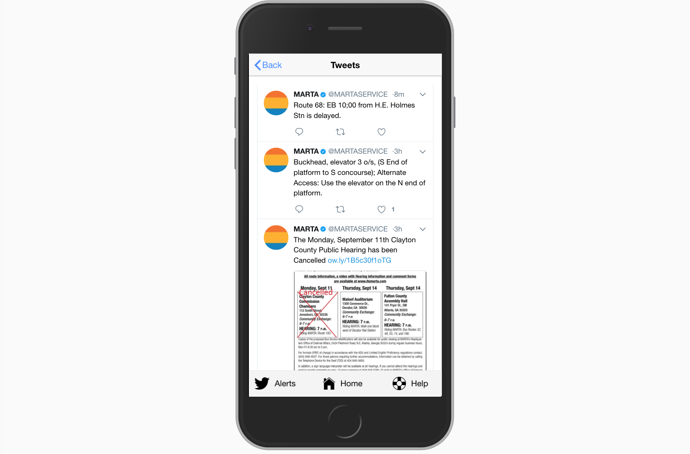

# MARTA IO 2

Marta.io 2 is a rebuild of the original Marta.io, which provides a real-time interface to easily view approaching trains at any MARTA station.

## Features

Like the original, Marta.io 2 displays realtime MARTA API results for trains updated every ten seconds. It breaks this data into three views:

* <b>[1. Dashboard]</b>

    

    The main view, a list of stations displays when you first launch the app. If location access is granted, the three closest stations stick to the top. Dragging left on a station lets you star it, which will place the station at the very top of the main stations list for quick access.

* <b>[2. Station View]</b>

    

    Tap a station on the dashboard and you can see its upcoming trains, with schedule data mixed in if no realtime data is present for a given direction.

* <b>[3. Train View]</b>

    

    After drilling down to station view, a second tap on a train takes you to that train's estimates. This is useful if you want to know when your train is estimated to arrive at a future station.

* <b>[4. Twitter Alerts]</b>

    

    The Twitter alerts tab allows users to view MARTA's latest tweets and potentially check train status or delays.
    
## MARTA Hackathon - Judgment Evaluation Categories

* <b>Impact</b>
    
    Does this project have the potential to make a positive change to transportation in metro Atlanta? Does it address an important problem?

    MARTA.io has an easily navigable interface that makes it easier for commuters to make quick decisions/gauge train availability.

    It addresses the current problem of MARTA's convoluted scheduling, which can make it difficult and intimidating for new riders to check what trains are available and when.

* <b>Viability</b>

    Would this project actually be used in the real world? Is it set up to be successful?

    Marta.io 2's mobile-first design is ideal because most MARTA commuters will be using their phones to check MARTA schedules, rather than a desktop computer. MARTA.io is also easily accessed via the Marta.io website.


* <b>Creativity</b>

    Does the project address a real-world problem in a smart, innovative way? Or do similar initiatives already exist?

    Similar initiatives exist, but MARTA.io is one of the most easily navigable interfaces available. It is comparably faster with a more straight-forward layout than the official MARTA app.

* <b>Execution</b>

    Given the constraints of the hackathon, how did the team execute in the time allotted? How impressive is their work?

    Updated the previous iteratio of MARTA.io to up-to-date technology (the newer version of Ionic). Important maintenance.

## With the Ionic CLI:

If you haven't used ionic before, you'll need to install it:

```bash
$ sudo npm install -g ionic cordova
```

Then, to run MartaIO, cd into run one of the following:

```bash
$ ionic serve # Runs locally in browser
$ ionic cordova run android # Runs on android emulator or device, you can add --device to force a run on device
$ ionic cordova run ios # Runs on ios emulator or device
$ ionic cordova build android --release # build an unsigned release for Amazon App Store
```

Edit the version in config.xml

```
<widget id="io.marta" version="2.0.2" xmlns="http://www.w3.org/ns/widgets" xmlns:cdv="http://cordova.apache.org/ns/1.0">
```
