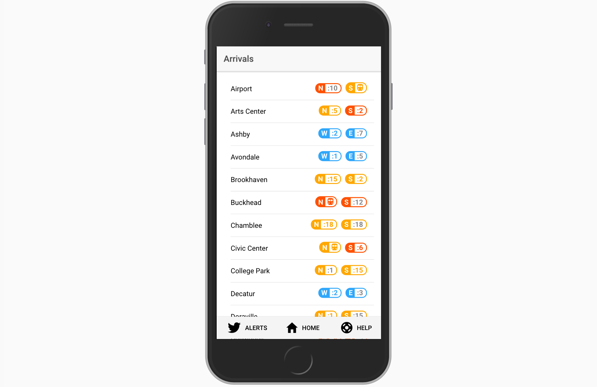
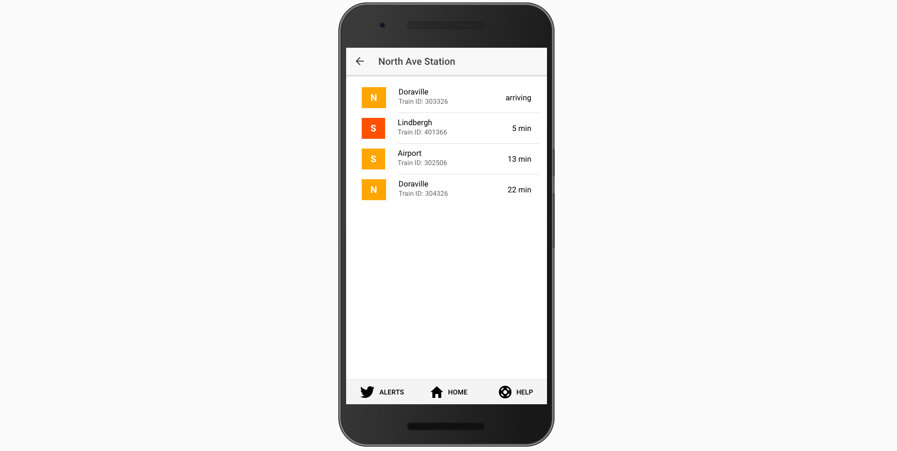
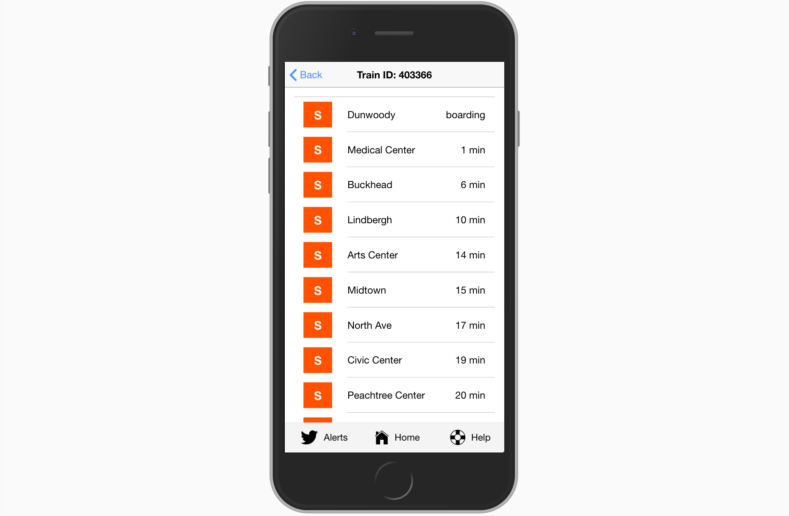

# MARTA IO 2

Marta.io 2 is a revamp of the original Marta.io, which provides a useful live-updating interface to quickly view approaching trains at any MARTA station.

## Features

Like the original, Marta.io 2 displays realtime MARTA API results for trains, updated every ten seconds. It breaks this data down into three views:

* <b>[1. Dashboard]</b>

    

    The main view, a list of stations shows when you first launch the app. If location access is granted, the three closest stations stick to the top. Dragging left on a station lets you star it, which will put it at the very top of your list for quick access.

* <b>[2. Station View]</b>

    

    Tap a station on the dashboard and you can see its upcoming trains, with schedule data mixed in if no realtime data is present for a given direction.

* <b>[3. Train View]</b>

    

    After drilling down to station view, a second tap on a train takes you to that train's estimates. This is useful if you want to know when your train is estimated to arrive at a future station.

## MARTA Hackathon - Judgment Evaluation Categories

* <b>Impact</b>
    
    Does this project have the potential to make a positive change to transportation in metro Atlanta? Does it address an important problem?

    Yes! MARTA.io has an easily navigable interface that makes it easier for commuters to make quick decisions/gauge train availability.
    It addresses the current problem of MARTA's convoluted scheduling-- makes it difficult/intimidating for new riders to check what trains are available and when.

* <b>Viability</b>

    Would this project actually be used in the real world? Is it set up to be successful?
    Yes! It's mobile-first design is ideal because most MARTA commuters will be using their phones to check MARTA schedules, rather than a desktop computer. MARTA.io is also easily accessed via their website.

* <b>Creativity</b>

    Does the project address a real-world problem in a smart, innovative way? Or do similar initiatives already exist?

    Similar initiatives exist, but MARTA.io is one of the most easily navigable interfaces available.

* <b>Execution</b>

    Given the constraints of the hackathon, how did the team execute in the time allotted? How impressive is their work?

    Updated the previous iteratio of MARTA.io to up-to-date technology (the newer version of Ionic). Important maintenance.

## Default Ionic Instructions

This is a starter template for [Ionic](http://ionicframework.com/docs/) projects.

### How to use this template

*This template does not work on its own*. The shared files for each starter are found in the [ionic2-app-base repo](https://github.com/ionic-team/ionic2-app-base).

To use this template, either create a new ionic project using the ionic node.js utility, or copy the files from this repository into the [Starter App Base](https://github.com/ionic-team/ionic2-app-base).

#### With the Ionic CLI:

Take the name after `ionic2-starter-`, and that is the name of the template to be used when using the `ionic start` command below:

```bash
$ sudo npm install -g ionic cordova
$ ionic start myTabs tabs
```

Then, to run it, cd into `myTabs` and run:

```bash
$ ionic cordova platform add ios
$ ionic cordova run ios
```

Substitute ios for android if not on a Mac.

